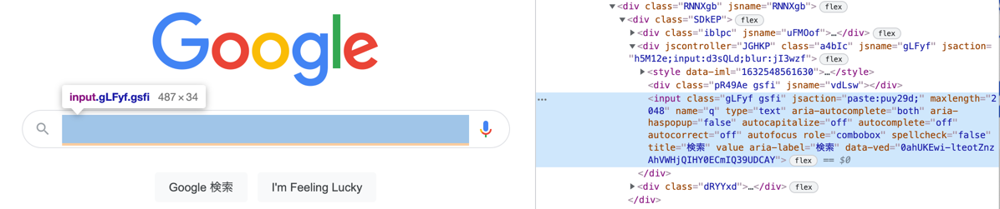
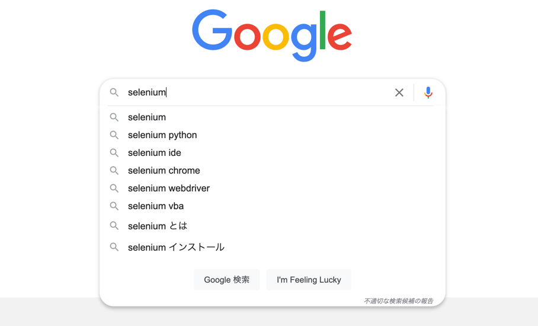

# Curl demonstration

In this demo, I will be automating Chrome browser via curl.

## Pre-requirement

- Chrome version: 94.0.4606.61
- Download Chrome driver (version: 94.0.4606.61) at <https://chromedriver.chromium.org/downloads>.

```
./chromedriver
Starting ChromeDriver 94.0.4606.41 (333e85df3c9b656b518b5f1add5ff246365b6c24-refs/branch-heads/4606@{#845}) on port 9515
Only local connections are allowed.
Please see https://chromedriver.chromium.org/security-considerations for suggestions on keeping ChromeDriver safe.
ChromeDriver was started successfully.
```

## Demonstration

I'm gonna do the following steps.

- Open browser
- Goto google.com
- Find the search bar
- Type words in search bar
- Click
- Close browser

## Run demo

### Open browser

Technically, WebDriver create a session.

```
curl http://localhost:9515/session \
    -X POST \
    -H "Content-Type: application/json" \
    -d '{"capabilities":{"alwaysMatch":{"goog:chromeOptions":{"args": ["--no-sandbox"]}}}}'
```

The response is like that.

```json
{
  "value": {
    "capabilities": {
      "acceptInsecureCerts": false,
      "browserName": "chrome",
      "browserVersion": "94.0.4606.61",
      "chrome": {
        "chromedriverVersion": "94.0.4606.41 (333e85df3c9b656b518b5f1add5ff246365b6c24-refs/branch-heads/4606@{#845})",
        "userDataDir": "/var/folders/t5/3p4crbvn2476w3xbrmstrmtr0000gn/T/.com.google.Chrome.PvCwbi"
      },
      "goog:chromeOptions": {
        "debuggerAddress": "localhost:52437"
      },
      "networkConnectionEnabled": false,
      "pageLoadStrategy": "normal",
      "platformName": "mac os x",
      "proxy": {},
      "setWindowRect": true,
      "strictFileInteractability": false,
      "timeouts": {
        "implicit": 0,
        "pageLoad": 300000,
        "script": 30000
      },
      "unhandledPromptBehavior": "dismiss and notify",
      "webauthn:extension:credBlob": true,
      "webauthn:extension:largeBlob": true,
      "webauthn:virtualAuthenticators": true
    },
    "sessionId": "7c51f90247d5648ec92a9ee73bacd098"
  }
}
```

The sessionId is important.
In the above response's example, `7c51f90247d5648ec92a9ee73bacd098` is that.


### Goto google.com

```
SESSIONID=7c51f90247d5648ec92a9ee73bacd098

curl http://localhost:9515/session/$SESSIONID/url \
    -X POST \
    -H "Content-Type: application/json" \
    -d '{"url": "https://www.google.co.jp/"}'
```

The response is like that.

```json
{"value":null}
```

### Find the search bar

Get the search bar with the CSS selector `[name="q"]`.



```
curl http://localhost:9515/session/$SESSIONID/element \
    -X POST \
    -H "Content-Type: application/json" \
    -d '{"using": "css selector", "value": "[name=\"q\"]"}'
```

The response is like that.

```json
{
  "value": {
    "element-6066-11e4-a52e-4f735466cecf": "84b10d39-94f5-4768-8457-dd218597a1e5"
  }
}
```

Element Id is `84b10d39-94f5-4768-8457-dd218597a1e5`.

### Type words in search bar

```
ELEMENTID=84b10d39-94f5-4768-8457-dd218597a1e5

curl http://localhost:9515/session/$SESSIONID/element/$ELEMENTID/value \
    -X POST \
    -H "Content-Type: application/json" \
    -d '{"text": "selenium"}'
```



### Click

- Find the search button element.

```
curl http://localhost:9515/session/$SESSIONID/element \
    -X POST \
    -H "Content-Type: application/json" \
    -d '{"using": "css selector", "value": "[name=\"btnK\"]"}'
```

Response is like that.

```
{
  "value": {
    "element-6066-11e4-a52e-4f735466cecf": "b1a465b1-80d5-417a-a0bc-ebbee670c8f6"
  }
}
```

- Click the search button

```
ELEMENTID=b1a465b1-80d5-417a-a0bc-ebbee670c8f6

curl http://localhost:9515/session/$SESSIONID/element/$ELEMENTID/click \
    -X POST \
    -H "Content-Type: application/json" \
    -d '{}'
```

You will get an error like that.

```json
{
  "value": {
    "error": "element not interactable",
    "message": "element not interactable\n  (Session info: chrome=94.0.4606.61",
    "stacktrace": "...(omit)"
  }
}
```

https://www.w3.org/TR/webdriver/#element-click

### Close browser

- Close browser, technically delete the session.

```
curl -XDELETE http://localhost:9515/session/$SESSIONID 
```
